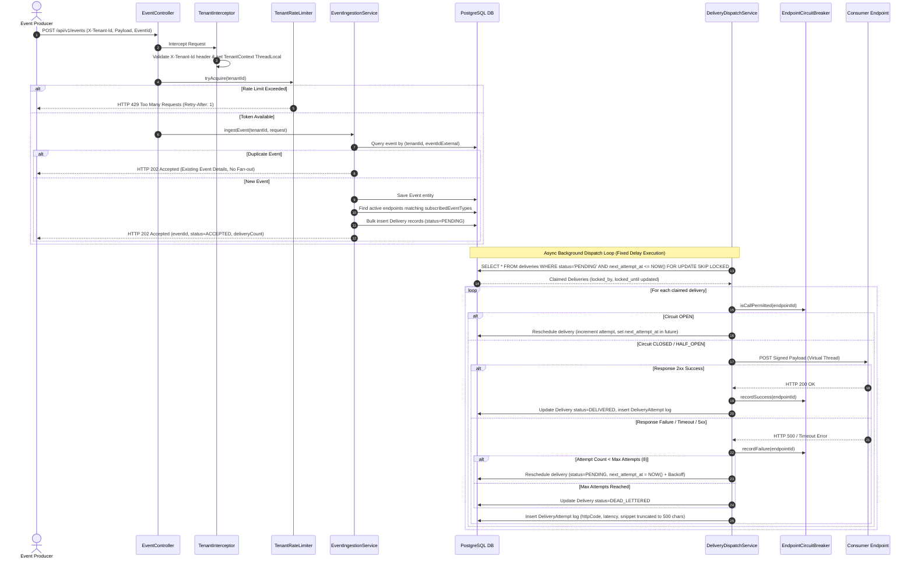

# System Architecture & Lifecycle Flow

This document details the architectural design, component interactions, concurrency model, resilience subsystems, security mechanisms, and data access patterns of the **Multi-Tenant Webhook Delivery Service**.

---

## 1. High-Level Architecture Overview

The system is designed around an **asynchronous, lock-free fan-out pipeline** with **database-backed state persistence**. 

```
                                  +------------------------------------+
                                  |     Tenant Applications / Producers |
                                  +------------------------------------+
                                                    |
                                                    | HTTP POST /api/v1/events
                                                    v
+---------------------------------------------------------------------------------------------------+
| Webhook Delivery Service (Spring Boot 4.x)                                                        |
|                                                                                                   |
|  +-----------------------+      +--------------------------+      +----------------------------+  |
|  | TenantInterceptor     | ---> | TenantRateLimiterService | ---> | EventIngestionService      |  |
|  | (X-Tenant-Id check)   |      | (In-Memory Token Bucket) |      | (DB Duplicate Check)       |  |
|  +-----------------------+      +--------------------------+      +----------------------------+  |
|                                                                                 |                 |
|                                                                                 v                 |
|                                                                   +----------------------------+  |
|                                                                   | Fan-out Matching Engine    |  |
|                                                                   | (Subscribed Endpoints)     |  |
|                                                                   +----------------------------+  |
|                                                                                 |                 |
+---------------------------------------------------------------------------------|-----------------+
                                                                                  v
                                                                    +----------------------------+
                                                                    |   PostgreSQL Database      |
                                                                    |  - events                  |
                                                                    |  - deliveries (PENDING)    |
                                                                    +----------------------------+
                                                                                  |
                                                                                  | SELECT FOR UPDATE
                                                                                  | SKIP LOCKED
                                                                                  v
+---------------------------------------------------------------------------------------------------+
| Delivery Dispatch Subsystem                                                                        |
|                                                                                                   |
|  +-----------------------------+     +-----------------------------+     +----------------------+ |
|  | DeliveryClaimService        | --> | EndpointCircuitBreaker      | --> | OutboundHttpClient   | |
|  | (Claims batch of PENDING)   |     | (State: Closed/Open)        |     | (Java 21 Virtual Threads) |
|  +-----------------------------+     +-----------------------------+     +----------------------+ |
|                                                                                     |             |
|                                                                                     v             |
|  +-----------------------------+     +-----------------------------+     +----------------------+ |
|  | DeliveryAttempt Audit Log   | <-- | Exponential Backoff Calculator| <-- | HMAC-SHA256 Payload  | |
|  | & DLQ Transition Logic      |     | (Base * 2^(n-1) + Jitter)   |     | Signature Engine     | |
|  +-----------------------------+     +-----------------------------+     +----------------------+ |
+---------------------------------------------------------------------------------|-----------------+
                                                                                  |
                                                                                  v HTTP POST
                                                                    +----------------------------+
                                                                    | Receiver Webhook Endpoint  |
                                                                    +----------------------------+
```

---

## 2. End-to-End Event Lifecycle Flow



---

## 3. Subsystem Breakdown

### 3.1 Tenant Isolation & Security Interceptor
- Every inbound REST API request is intercepted by `TenantInterceptor`.
- The interceptor verifies the mandatory `X-Tenant-Id` header against the DB table `tenants`.
- If valid, the tenant ID is stored in a `ThreadLocal` context (`TenantContext`), guaranteeing that downstream controllers and repositories execute strictly within that tenant's boundaries.
- Cross-tenant requests (e.g. attempting to read another tenant's delivery log or endpoint secret via path parameter manipulation) result in an immediate `404 Not Found` or `401 Unauthorized`.

### 3.2 Ingestion & Deduplication Pipeline
- **Producer Idempotency**: Producers supply an `eventId` (`event_id_external`).
- A compound unique constraint on `(tenant_id, event_id_external)` in PostgreSQL prevents duplicate inserts under concurrent requests.
- When a duplicate is received, `EventIngestionService` catches the constraint violation / query match and returns `202 Accepted` with the existing status without triggering a duplicate fan-out delivery.

### 3.3 DB-Level Due-Work Selection & Concurrency Engine
- **No In-Memory Filtering**: Unlike systems that fetch all rows into Java memory and filter with streams, this service delegates job claiming directly to PostgreSQL using:
  ```sql
  SELECT * FROM deliveries
  WHERE status = 'PENDING'
    AND next_attempt_at <= :now
    AND locked_until < :now
  ORDER BY next_attempt_at ASC
  LIMIT :batchSize
  FOR UPDATE SKIP LOCKED;
  ```
- **Lock-Free Multithreading**: Multiple worker nodes or concurrent execution threads run this query simultaneously. `SKIP LOCKED` ensures that rows claimed by Worker A are silently skipped by Worker B without blocking or lock contention.
- **Java 21 Virtual Threads**: Outbound HTTP requests are dispatched using `Executors.newVirtualThreadPerTaskExecutor()`. Millions of virtual threads can be spawned at minimal CPU and memory overhead, isolating slow receiver endpoints.

### 3.4 Security & SSRF Protection
- **HMAC-SHA256 Payload Signing**: Every endpoint is assigned a cryptographically secure 64-character hex secret key upon registration. Outbound webhook payloads are signed using HMAC-SHA256:
  ```
  X-Webhook-Signature: t=1771182300,v1=a8f9c2...
  X-Webhook-Timestamp: 1771182300
  X-Webhook-Event-Type: order.created
  X-Webhook-Delivery-Id: del_881920
  ```
- **SSRF (Server-Side Request Forgery) Guard**: Endpoint URLs are validated upon registration and before dispatch. Requests to loopback addresses (`127.0.0.1`, `localhost`), RFC 1918 private subnets (`10.0.0.0/8`, `172.16.0.0/12`, `192.168.0.0/16`), link-local (`169.254.0.0/16`), and multicast addresses are rejected automatically unless explicitly permitted by configuration.

### 3.5 Resilience & Self-Healing Architecture
1. **Endpoint Circuit Breaker**: Managed by `EndpointCircuitBreakerService`.
   - Tracks consecutive delivery failures per endpoint.
   - Triggers an `OPEN` state after 5 consecutive failures.
   - Cooldown window: 60 seconds before transitioning to `HALF_OPEN` to test recovery.
   - Protects failing receiver servers from being bombarded during outages.
2. **Exponential Backoff with Equal Jitter**:
   - Backoff delay formula:
     $$\text{delay} = \text{base\_delay} \times 2^{(\text{attempt} - 1)}$$
   - With 50% Equal Jitter:
     $$\text{actual\_delay} = \frac{\text{delay}}{2} + \text{random}(0, \frac{\text{delay}}{2})$$
   - Prevents "thundering herd" problems when receiver servers recover.
3. **Dead-Letter Queue (DLQ) & Redrive**:
   - Deliveries that fail max attempts (default: 8) transition to `DEAD_LETTERED`.
   - Tenants can trigger manual redrive via `POST /api/v1/deliveries/{id}/redrive`, resetting `status=PENDING`, `attempt_count=0`, and `next_attempt_at=NOW()`.
4. **Zero-Loss Crash Recovery**:
   - When a worker claims a delivery, it sets `locked_until = NOW() + 30 seconds`.
   - If a worker node dies unexpectedly mid-delivery, `CrashRecoveryService` periodically runs a background task clearing locks where `locked_until < NOW()`, making the delivery immediately claimable by active workers.

---

## 4. Database Schema & Indexing Strategy

```
+------------------+         +--------------------------+
|     tenants      |         |        endpoints         |
+------------------+         +--------------------------+
| id (PK)          | <-----+ | id (PK)                  |
| name             |         | tenant_id (FK)           |
| created_at       |         | url                      |
+------------------+         | secret                   |
                             | subscribed_event_types[] |
                             | status (ACTIVE/DISABLED) |
                             | created_at               |
                             +--------------------------+
                                         ^
                                         |
+------------------+         +-----------+--------------+
|      events      |         |        deliveries        |
+------------------+         +--------------------------+
| id (PK)          | <-----+ | id (PK)                  |
| tenant_id (FK)   |         | event_id (FK)            |
| event_id_ext (UQ)|         | endpoint_id (FK)         |
| type             |         | tenant_id (FK)           |
| payload (JSONB)  |         | status (PENDING/DELIV..) |
| created_at       |         | attempt_count            |
+------------------+         | next_attempt_at          |
                             | locked_by / locked_until |
                             +--------------------------+
                                         ^
                                         |
                             +-----------+--------------+
                             |    delivery_attempts     |
                             +--------------------------+
                             | id (PK)                  |
                             | delivery_id (FK)         |
                             | attempt_number           |
                             | response_code            |
                             | latency_ms               |
                             | error / snippet          |
                             | created_at               |
                             +--------------------------+
```

### Critical Partial Index for Sub-Millisecond Due-Work Claiming
```sql
CREATE INDEX idx_deliveries_pending_claim
ON deliveries (status, next_attempt_at)
WHERE status = 'PENDING';
```
This partial index ensures PostgreSQL can locate pending due deliveries instantly without scanning millions of historical `DELIVERED` or `DEAD_LETTERED` records.
